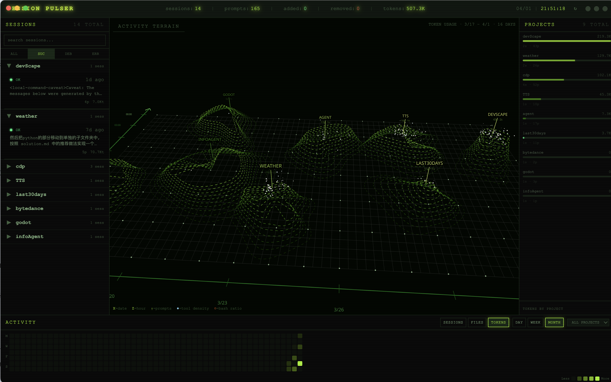

# DevScape — SESSION PULSER

> 一个赛博朋克风格的桌面仪表盘，将你的 AI 辅助开发历程可视化为炫酷的 3D 地形图。



---

## 功能概览

| 模块 | 描述 |
|------|------|
| **3D Activity Terrain** | Three.js 线框地形图，X 轴为时间（近 30 天），Z 轴为项目，Y 轴为 Token 消耗量，带呼吸动画 |
| **Session Cards** | 左侧面板，按时间倒序排列所有会话，显示首尾 Prompt、状态指示灯、Token 统计 |
| **Drill-down View** | 点击任意会话，展开完整对话记录，含 Token 逐条统计 |
| **Projects Panel** | 右侧面板，各项目 Token 消耗横向条形图 |
| **Activity Heatmap** | 底部 GitHub 风格热力图，支持 SESSIONS / FILES / TOKENS 三种维度切换 |
| **Top Metrics Bar** | 全局统计：总会话数、总 Prompt 数、代码行增删、Token 总量，带数字跳动动画 |

---

## 快速开始

```bash
# 克隆项目
git clone <repo-url>
cd devScape

# 安装依赖
npm install

# 启动开发模式（打开 Electron 窗口）
npm run dev

# 生产构建
npm run build
```

**数据来源**：自动读取 `~/.claude/projects/` 下的所有 `.jsonl` 会话文件，无需任何配置。

### 系统要求

- Node.js 18+
- macOS / Windows / Linux
- 已安装并使用过 Claude Code（数据来源）

---

## 技术栈

| 层级 | 技术选型 |
|------|----------|
| 桌面容器 | Electron 28 |
| 构建工具 | electron-vite 2 |
| 前端框架 | React 18 + TypeScript |
| 3D 渲染 | Three.js + @react-three/fiber + @react-three/drei |
| 状态管理 | Zustand |
| 样式 | TailwindCSS 3（自定义赛博朋克主题） |
| 字体 | JetBrains Mono / Space Mono |

---

## 项目结构

```
devScape/
├── src/
│   ├── main/
│   │   ├── index.ts              # Electron 主进程 + IPC 处理
│   │   └── claude-parser.ts      # 解析 ~/.claude/projects/ JSONL
│   ├── preload/
│   │   └── index.ts              # contextBridge API
│   └── renderer/src/
│       ├── App.tsx               # 四区域布局
│       ├── store/index.ts        # Zustand 全局状态
│       ├── types/index.ts        # 数据类型定义
│       └── components/
│           ├── TopBar.tsx        # 顶部指标栏
│           ├── SessionList.tsx   # 左侧会话列表
│           ├── SessionCard.tsx   # 单条会话卡片
│           ├── TerrainView.tsx   # 中央 3D 地形
│           ├── ProjectsList.tsx  # 右侧项目统计
│           ├── ActivityHeatmap.tsx  # 底部热力图
│           └── DrilldownView.tsx    # 会话详情覆盖层
├── spec/                         # 设计参考截图
├── electron.vite.config.ts
├── tailwind.config.js
└── package.json
```

---

## 数据格式说明

Claude Code 将会话数据存储在 `~/.claude/projects/<project-dir>/<sessionId>.jsonl`：

- **项目目录命名**：将实际路径中的 `/` 替换为 `-`，如 `/Users/foo/my-app` → `-Users-foo-my-app`
- **消息类型**：`user` / `assistant` / `system` / `progress` / `file-history-snapshot`
- **Token 字段**（assistant 消息）：`input_tokens`, `output_tokens`, `cache_creation_input_tokens`, `cache_read_input_tokens`

---

## Roadmap

### ✅ Phase 1 — MVP（当前版本）

Claude Code 数据接入，完整可视化仪表盘。

- [x] 解析 `~/.claude/projects/` JSONL 文件
- [x] 3D 线框地形图（Token × 时间 × 项目）
- [x] 会话卡片列表 + 搜索过滤
- [x] 点击展开完整对话详情
- [x] GitHub 风格活动热力图
- [x] 项目 Token 分布面板
- [x] 赛博朋克 UI 主题

---

### 🔜 Phase 2 — 多工具支持

接入更多 AI 编码工具，统一展示。

#### Cursor
- [ ] 解析 `~/Library/Application Support/Cursor/User/workspaceStorage/*/state.vscdb`
- [ ] 提取 `ItemTable` 中的 Chat / Composer 记录
- [ ] 映射 workspace hash → 真实项目路径（via `workspace.json`）

#### Trae（字节跳动）
- [ ] 解析 `~/Library/Application Support/Trae/User/workspaceStorage/`
- [ ] 提取 Solo 模式任务列表（task status: completed / interrupted / waiting）
- [ ] 解析 Agent 执行步骤与工具调用记录

#### Codex / OpenAI CLI
- [ ] 读取 `~/.codex/` 本地历史记录
- [ ] 解析标准输出日志

#### Windsurf / Continue / Cline
- [ ] 适配各工具的本地存储格式

---

### 🚀 Phase 3 — Rust 高性能引擎

用 Rust 替换 Node.js 数据层，实现实时监听与高效聚合。

**架构方案**：Rust 编译为 `napi-rs` 原生 Node 模块，直接嵌入 Electron 主进程（零额外进程开销）。

```
Electron Main Process
└── Rust Native Module (napi-rs)
    ├── DirectoryWatcher     # notify 库，监听文件变更
    ├── JonlParser           # 增量解析新增行（不重复读取）
    ├── SqliteReader         # rusqlite 只读访问 Cursor/Trae .vscdb
    ├── DataAggregator       # 内存聚合，维护热数据缓存
    └── SQLite Store         # sqlx + SQLite，本地持久化历史数据
```

**核心优势**：
- [ ] 文件变更监听（`notify` crate），新会话实时推送到前端
- [ ] 增量解析：只读取 JSONL 末尾新增行，内存占用极低
- [ ] 并发读取多个 `.vscdb` 文件（`tokio` 异步运行时）
- [ ] 本地 SQLite 持久化：历史统计无需每次重新扫描
- [ ] Tiktoken 估算 Token 数（兼容无原始 usage 字段的工具）

---

### 🧠 Phase 4 — Dev as Life 个人全景智脑

将 AI 编码记录延伸为完整的开发者数字生活存档。

- [ ] **Git 集成**：关联 Commit 记录与 AI 会话，展示「问题→AI对话→提交」完整链路
- [ ] **终端历史**：读取 `.zsh_history` / `.bash_history`，与 AI 会话时间轴对齐
- [ ] **自动标签**：本地模型（Ollama）自动分类会话为 Bug Fix / Feature / Refactor / Debug
- [ ] **知识关系图**：节点网络图，展示项目、会话、技术概念之间的关联
- [ ] **周报生成**：每周调用本地大模型，生成个人研发周报（技术成长 + Token 消耗分析）
- [ ] **Obsidian 集成**：将 AI 会话摘要写入本地笔记库

---

## Contributing

欢迎 PR 和 Issue，特别是以下方向：

1. 新工具的数据解析适配（Cursor / Trae / Windsurf 等）
2. Rust napi-rs 模块的实现
3. 更多可视化组件（时间轴、关系图等）
4. UI 主题定制

---

## License

MIT
